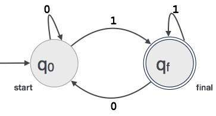

有限自动机是一种状态机，它将一串符号作为输入并相应地改变其状态。有限自动机是正则表达式的识别器。当正则表达式字符串被送入有限自动机时，它会改变每个文字的状态。如果输入字符串被成功处理并且自动机达到其最终状态，则它被接受，即刚刚被馈送的字符串被认为是手中语言的有效标记。

有限自动机的数学模型包括：

有限状态集（Q）
有限的输入符号集（Σ）
一开始状态（q0）
最终状态集（qf）
过渡函数（δ）
转移函数（δ）将有限状态集（Q）映射到有限的输入符号集（Σ），Q×Σ➔Q

# 有限自动机构造
设L（r）是一些有限自动机（FA）识别的常规语言。

国家：FA的国家由圆圈代表。州名写在圈内。

启动状态：自动机启动的状态称为启动状态。开始状态有一个指向它的箭头。

中间状态：所有中间状态至少有两个箭头; 一个指向另一个指出他们。

最终状态：如果成功解析了输入字符串，则预计自动机将处于此状态。最终状态由双圈表示。它可能有任何奇数个箭头指向它，甚至有多个箭头指向它。奇数箭头的数量大于偶数，即奇数=偶数+ 1。

转换：当找到输入中的所需符号时，会发生从一种状态到另一种状态的转换。转换后，自动机可以移动到下一个状态或保持相同的状态。从一个状态到另一个状态的移动显示为有向箭头，其中箭头指向目标状态。如果自动机停留在相同的状态，则绘制从状态指向其自身的箭头。

# 栗子
示例：我们假设FA接受以数字1结尾的任何三位二进制值.FA = {Q（q 0，q f），Σ（0,1），q 0，q f，δ}

