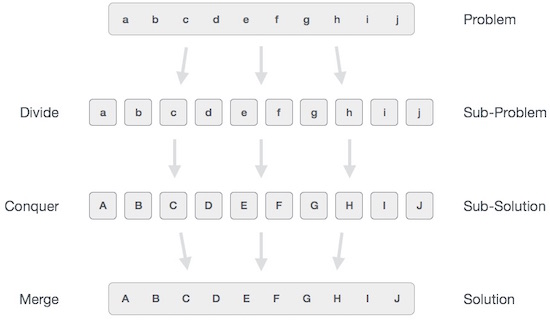

# 分而治之

在分而治之方法中，每个问题被分成小的子问题，然后每个问题独立解决，最后大的问题彻底解决。

从广义上讲，我们可以通过三个步骤来理解分而治之的方法。

# 分割

此步骤涉及将问题分解为更小的子问题。子问题应该代表原始问题的一部分。此步骤通常采用递归方法来划分问题，直到子问题不再可被整除为止。在这个阶段，子问题本质上是原子的，但仍然代表了实际问题的某些部分。

# 解决

这一步收到了许多较小的子问题需要解决。通常，在这个级别上，问题被认为是自己“解决”的。

# 合并

当小的问题解决以后，大的问题由小的问题合并，即，大的问题也彻底解决

# 栗子

合并排序

快速排序

二进制搜索

矩阵乘法

最近的一对

