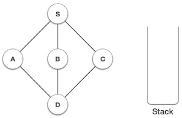
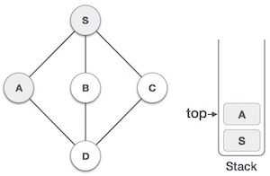
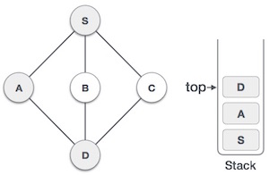

# 概述
深度优先搜索（DFS）算法以向深运动的方式遍历图形，并使用堆栈记住在任何迭代中发生死角时获取下一个顶点以开始搜索。

如在上面给出的示例中，DFS算法首先从S到A到D到G到E到B，然后到F，最后到C.它采用以下规则。

规则1 - 访问相邻的未访问顶点。将其标记为已访问。显示它。将其推入堆栈。

规则2 - 如果未找到相邻顶点，则从堆栈中弹出一个顶点。（它将弹出堆栈中的所有顶点，这些顶点没有相邻的顶点。）

规则3 - 重复规则1和规则2，直到堆栈为空。

序号 | 图示 | 描述
-----|-----|----- 
1 |  | 初始化堆栈
2|  | 将S标记为已访问并将其放入堆栈。从S探索任何未访问的相邻节点。我们有三个节点，我们可以选择其中任何一个。对于此示例，我们将按字母顺序获取节点。
3 |  | 将A标记为已访问并将其放入堆栈。从A探索任何未访问的相邻节点.S和D都与A相邻，但我们只关注未访问的节点。
4 |  | 访问D并将其标记为已访问并放入堆栈。在这里，我们有B和C节点，它们与D相邻并且两者都是未访问的。但是，我们将再次按字母顺序选择。
5 | 