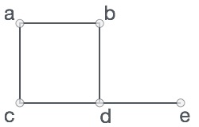

# 概述
图是一组对象的图表示，其中一些对象通过链接连接，互连对象由顶点的点标识，连接顶点的链接称为边。

形式上，图是一对集合（V， E）， 其中V是顶点集合，E是边缘集合，连接顶点对，形成以下图表

在上图中，

V = {a，b，c，d，e}

E = {ab，ac，bd，cd，de}

# 图数据结构
数学中的图可以用数据结构标识，可以使用顶点数组和二维边数组来表示图形。
下方为一些术语；

顶点 -图形的每个节点都表示为顶点，在下面的示例中，标记的圆圈标识顶点，因此A到G是顶点，我们可以使用数组来表示它们。如下所示，可以通过索引0来识别，B可以使用索引1来识别。
> 顶点一般使用一维数组表示

边 - 边标识两个顶点之间的路径或两个顶点之间的线，在以下的示例中，从A到B，B到C等的线表示边，我们可以使用二维数组来标识，如下所示，这里AB可以在行0，列1，BC处表示为1，在行1，列2处，依次类推。
> 边，是两个顶点之间的线条，用二维数组表示两个顶点之间的边

邻接 - 如果两个节点或顶点通过边缘相互连接，则它们相邻。在以下示例中，B与A相邻，C与B相邻，依此类推。

路径 - 路径表示两个顶点之间的边缘序列。在以下示例中，ABCD表示从A到D的路径。

# 基本操作
以下是图表的基本主要操作 -

添加顶点 - 向图形添加顶点。

添加边 - 在图的两个顶点之间添加边。

显示顶点 - 显示图形的顶点。

