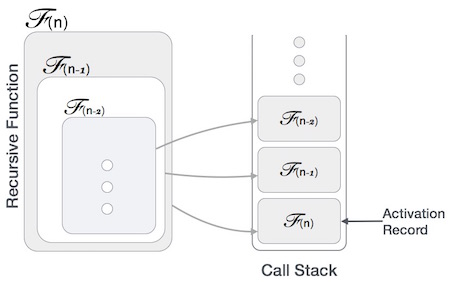

# 概述
某些计算机编程语言允许模块或函数调用自身。这种技术称为递归。在递归中，函数α直接调用自身或调用函数β，而函数β又调用原始函数α。函数α称为递归函数。

示例 - 调用自身的函数。

```
int function(int value) {
   if(value < 1)
      return;
   function(value - 1);

   printf("%d ",value);   
}

```

示例 - 调用另一个函数的函数，该函数又调用它。

```
int function1(int value1) {
   if(value1 < 1)
      return;
   function2(value1 - 1);
   printf("%d ",value1);   
}
int function2(int value2) {
   function1(value2);
}

```

# 属性
递归函数可以像循环一样无限。为了避免递归函数的无限运行，递归函数必须具有两个属性 -

基本标准 - 必须至少有一个基本条件或条件，这样，当满足此条件时，函数将停止递归调用自身。

渐进式方法 - 递归调用应该以这样一种方式进行，即每次进行递归调用时它都更接近基本条件。

# 实现
许多编程语言通过堆栈实现递归。通常，只要函数（调用者）将另一个函数（被调用者）或其自身调用为被调用者，调用者函数就会将执行控制转移给被调用者。该传输过程还可能涉及一些要从呼叫者传递给被呼叫者的数据。

这意味着，调用函数必须暂时暂停其执行，并在执行控制从被调用函数返回时稍后恢复。在这里，调用函数需要从执行点开始，它将自己置于保持状态。它还需要与其正在处理的完全相同的数据值。为此，为调用者函数创建激活记录（或堆栈帧）。



此激活记录保存有关局部变量，形式参数，返回地址和传递给调用函数的所有信息的信息。

# 递归分析
有人可能会争论为什么要使用递归，因为迭代可以完成相同的任务。第一个原因是，递归使程序更具可读性，并且由于最新的增强型CPU系统，递归比迭代更有效。

## 时间复杂性
在迭代的情况下，我们采用迭代次数来计算时间复杂度。同样，在递归的情况下，假设一切都是常量，我们试图找出递归调用的次数。对函数的调用是Ο（1），因此递归调用的（n）次数产生递归函数Ο（n）。

## 空间复杂性
空间复杂度计算为模块执行所需的额外空间量。在迭代的情况下，编译器几乎不需要任何额外的空间。编译器不断更新迭代中使用的变量值。但是在递归的情况下，每次进行递归调用时系统都需要存储激活记录。因此，认为递归函数的空间复杂度可能高于具有迭代的函数的空间复杂度。

