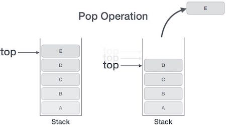

# 堆栈
堆栈是一种抽象数据类型（ADT），通常用于大多数编程语言。它被命名为堆栈，因为它表现得像真实世界的堆栈，例如 - 一副牌或一堆盘子等。


真实世界的堆栈只允许在一端进行操作。例如，我们只能从堆栈顶部放置或移除卡或板。同样，Stack ADT仅允许一端的所有数据操作。在任何给定时间，我们只能访问堆栈的顶部元素。

此功能使其成为LIFO数据结构。LIFO代表Last-in-first-out。这里，首先访问最后放置（插入或添加）的元素。在堆栈术语中，插入操作称为PUSH操作，删除操作称为POP操作。

# 堆栈表示
下图描绘了一个堆栈及其操作 -


堆栈可以通过数组，结构，指针和链接列表来实现。堆栈可以是固定大小的堆栈，也可以具有动态调整大小的感觉。在这里，我们将使用数组实现堆栈，这使得它成为固定大小的堆栈实现。

# 基本操作
堆栈操作可能涉及初始化堆栈，使用它然后取消初始化。除了这些基本内容之外，堆栈还用于以下两个主要操作 -

push（） - 在堆栈上推送（存储）一个元素。


pop（） - 从堆栈中删除（访问）一个元素。

当数据被推入堆栈时。

要有效地使用堆栈，我们还需要检查堆栈的状态。出于同样的目的，将以下功能添加到堆栈中 -

peek（） - 获取堆栈的顶部数据元素，而不删除它。

isFull（） - 检查堆栈是否已满。

isEmpty（） - 检查堆栈是否为空。

在任何时候，我们都维护一个指向堆栈上最后一个PUSHed数据的指针。由于此指针始终表示堆栈的顶部，因此命名为top。的顶部指针提供栈顶部的值，而无需实际删除它。

首先，我们应该了解支持堆栈功能的过程 -

# peek()
peek（）函数的算法 -

```
begin procedure peek
   return stack[top]
end procedure
```

用C编程语言实现peek（）函数 -

```
int peek() {
   return stack[top];
}
```

# isfull()
isfull（）函数的算法
```
begin procedure isfull

   if top equals to MAXSIZE
      return true
   else
      return false
   endif
   
end procedure
```

在C编程语言中实现isfull（）函数 -

```
bool isfull() {
   if(top == MAXSIZE)
      return true;
   else
      return false;
}
```

# isempty()
isempty（）函数的算法 -
```
begin procedure isempty

   if top less than 1
      return true
   else
      return false
   endif
   
end procedure
```

在C编程语言中实现isempty（）函数略有不同。我们初始化顶部为-1，因为数组中的索引从0开始。因此我们检查顶部是否低于零或-1以确定堆栈是否为空。这是代码 -

```
bool isempty() {
   if(top == -1)
      return true;
   else
      return false;
}
```

# 压栈操作
将新数据元素放入堆栈的过程称为推送操作。推送操作涉及一系列步骤 -

第1步 - 检查堆栈是否已满。

步骤2 - 如果堆栈已满，则产生错误并退出。

步骤3 - 如果堆栈未满，则从上到下增加下一个空白区域。

步骤4 - 将数据元素添加到堆栈位置，top指向该位置。

第5步 - 返回成功。


如果链表用于实现堆栈，那么在步骤3中，我们需要动态分配空间。

## PUSH()算法
Push操作的简单算法可以推导如下 -


```
begin procedure push: stack, data

   if stack is full
      return null
   endif
   
   top ← top + 1
   stack[top] ← data

end procedure
```
在C中实现这个算法非常容易。请参阅以下代码 -


```
void push(int data) {
   if(!isFull()) {
      top = top + 1;   
      stack[top] = data;
   } else {
      printf("Could not insert data, Stack is full.\n");
   }
}
```
# 弹栈操作

从堆栈中删除内容时访问内容称为弹出操作。在pop（）操作的数组实现中，实际上并未删除数据元素，而是将top递减到堆栈中的较低位置以指向下一个值。但是在链表实现中，pop（）实际上删除了数据元素并释放了内存空间。

Pop操作可能涉及以下步骤 -

第1步 - 检查堆栈是否为空。

第2步 - 如果堆栈为空，则产生错误并退出。

步骤3 - 如果堆栈不为空，则访问顶部指向的数据元素。

第4步 - 将top的值减1。

第5步 - 返回成功。



## POP()算法
一个简单的Pop操作算法可以推导如下 -

```
begin procedure pop: stack

   if stack is empty
      return null
   endif
   
   data ← stack[top]
   top ← top - 1
   return data

end procedure
```

在C中实现该算法如下 -

```
int pop(int data) {

   if(!isempty()) {
      data = stack[top];
      top = top - 1;   
      return data;
   } else {
      printf("Could not retrieve data, Stack is empty.\n");
   }
}
```

# 完整程序
```
#include <stdio.h>

int MAXSIZE = 8;       
int stack[8];     
int top = -1;            

int isempty() {

   if(top == -1)
      return 1;
   else
      return 0;
}
   
int isfull() {

   if(top == MAXSIZE)
      return 1;
   else
      return 0;
}

int peek() {
   return stack[top];
}

int pop() {
   int data;
	
   if(!isempty()) {
      data = stack[top];
      top = top - 1;   
      return data;
   } else {
      printf("Could not retrieve data, Stack is empty.\n");
   }
}

int push(int data) {

   if(!isfull()) {
      top = top + 1;   
      stack[top] = data;
   } else {
      printf("Could not insert data, Stack is full.\n");
   }
}

int main() {
   // push items on to the stack 
   push(3);
   push(5);
   push(9);
   push(1);
   push(12);
   push(15);

   printf("Element at top of the stack: %d\n" ,peek());
   printf("Elements: \n");

   // print stack data 
   while(!isempty()) {
      int data = pop();
      printf("%d\n",data);
   }

   printf("Stack full: %s\n" , isfull()?"true":"false");
   printf("Stack empty: %s\n" , isempty()?"true":"false");
   
   return 0;
}
```

结果如下
```
Element at top of the stack: 15
Elements:
15
12
1 
9 
5 
3 
Stack full: false
Stack empty: true
```